# Visual analysis of the proportion of various wine categories in various countries and the influencing factors of wine prices

This work is for the 2022 Comprehensive Practice I: Introduction to Data Visualization Design of the School of Computer Science, Zhejiang University, and the copyright belongs to the author

Instructor: Liu Shuhan

# 1. Work introduction

**(1) Theme of the work**

   The work focuses on the category of **"wine"**, and makes a visual analysis of the proportion of **categories** and **factors affecting wine prices** of various categories of wines in various countries.

**(2) Problems to be solved**

1. The proportion and size of wine varieties in each wine producing country 

2. The price of wine in each wine-producing country, which country's wine is generally very expensive.

3. What are the main factors affecting the price of wine.

# 2. Data introduction

**(1) Data source and format**

https://www.kaggle.com/datasets/dev7halo/wine-information

The data in this dataset was collected by the author on the Korean website on May 24, 2021, so the standard is consistent with that of South Korea, and the price unit is also Korean won.

The main information is as follows:

| 1) wine ID            | 21) wine type                       | 27) wine body                    |
| --------------------- | ----------------------------------- | -------------------------------- |
| 2) Wine name          | 22) Wine use                        | 28) Tannin                       |
| 3) Production company | 23) Abv-alcohol content             | 29) Wine price                   |
| 4) Country of origin  | 24) Recommended serving temperature | 30) Production year              |
| 5)~8) local&region    | 25) sweetness                       | 31) capacity of each bottle (ml) |
| 9)~20) Grape variety  | 26) Acidity                         |                                  |

abv: At 20°C, the percentage by volume of ethanol in wine.

Degrees: Optimum drinking temperature.

Sweetness: Sweetness refers to the residual sugar content of a wine.

Acidity: Relative acid content.

Wine body: related to the thickness of the wine. The higher the body level, the thicker and full-bodied the wine.

Tannin: A bitter plant polyphenol compound, the higher the level of tannin, the smoother the wine taste.

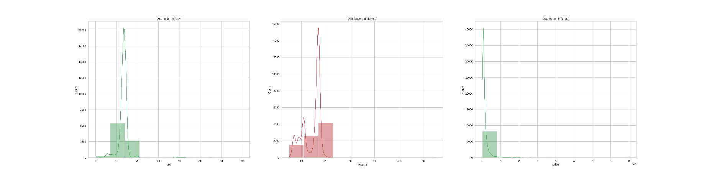

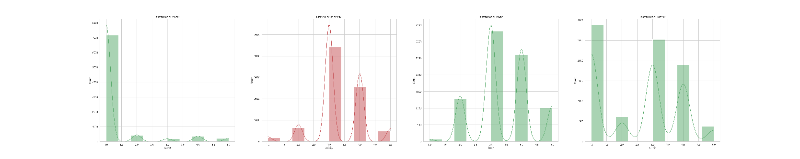

**(3) Data cleaning**

Use python to clean and get To_json/price.csv, the interval division method is as shown in the figure below (because wine prices are concentrated in the low-price segment, the interval range for the low-price segment is smaller, and the interval range for the high-price segment is larger)

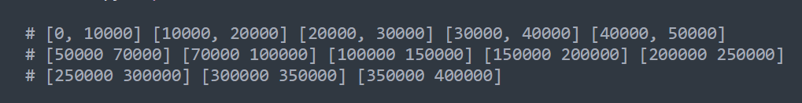

# 3. Data processing

First, the data is preprocessed to observe the mutual influence of each indicator. A scatterplot was drawn using python's **draw.py** to study multicollinearity (there is a correlation between some variables).

 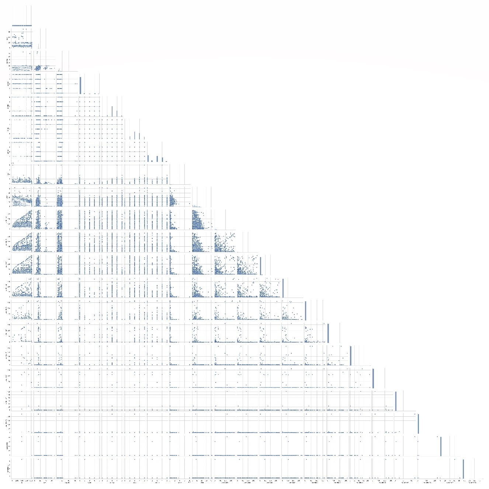

Because the dependence between the price and the other 7 indicators seems to be non-linear, the results of linear regression are poor (so this part of the work is not shown in the report), so **kernel regression** is processed, and python's seaborn library is used (**machine learning/draw.py**) draws the seven **marginal histogram smooth kernel density maps** below, as shown in [[2\]](#_ftn2)

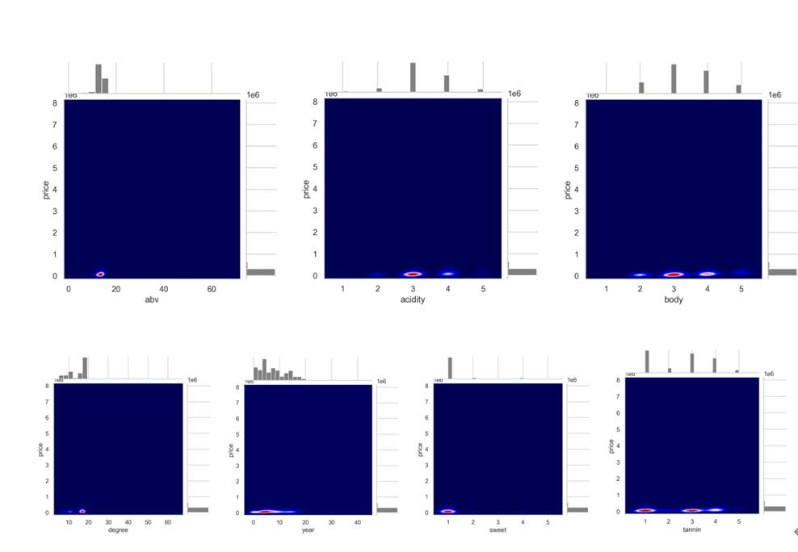

When analyzing the influencing factors of prices, a parallel coordinate graph is used. In order to simplify the drawing and better show the correlation, **analyzeCluster.py** uses the **k-means algorithm** to analyze the original 8281 data according to the wine The types of wine were clustered, and 12 cluster centers were generated for each wine

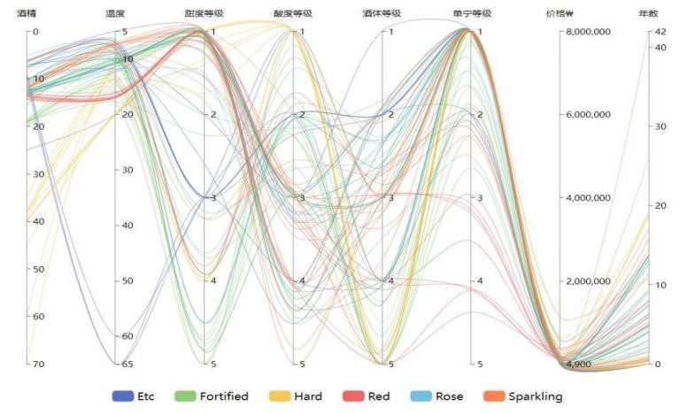

When analyzing the influencing factors of prices, a parallel coordinate graph is used. In order to simplify the drawing and better show the correlation, **analyzeCluster.py** uses the **k-means algorithm** to analyze the original 8281 data according to the wine The types of wine were clustered, and 12 cluster centers were generated for each wine

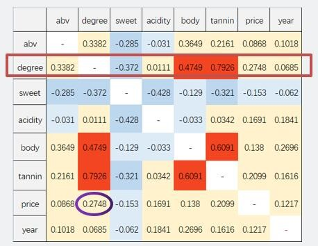

 

# 4. Visualization and Interaction Design

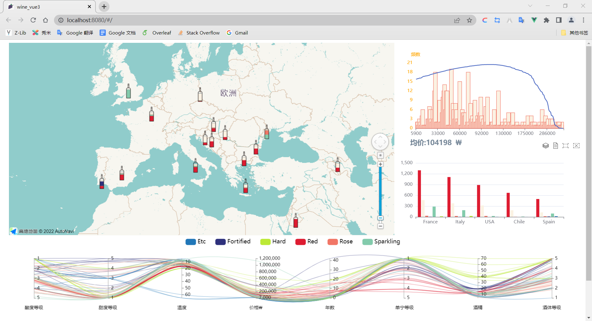

1. A wine bottle is placed in the capital of each country, representing the proportion of various types of wine in this country.

2. Click the wine bottle icon of the country, and you can see the distribution of wine prices in the country, the internal proportion of the type, and the comparison with countries with similar wine production in the auxiliary view on the right. A wine bottle reflects the proportion of various types of wine in a country. Each layer represents a type of wine, and the greater the height of each layer, the larger the proportion.

   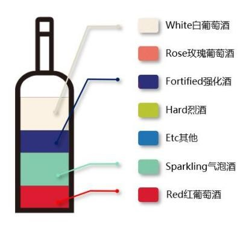

   1. The side views are the price distribution interval map and the wine type distribution map.
   2. The horizontal axis of the price distribution chart represents the wine price, and the vertical axis represents the frequency of red wine at this price. The higher the square, the greater the frequency. At the same time, the blue curve in the figure is the curve fitted by the Gaussian function.
   3. The wine bottles in the main view represent the relative proportion of a country, while the wine distribution map represents the absolute data of a country, which can be compared with neighboring countries. At the same time, the wine distribution map can be clicked to switch to a stacked map and a data view to display it more clearly.

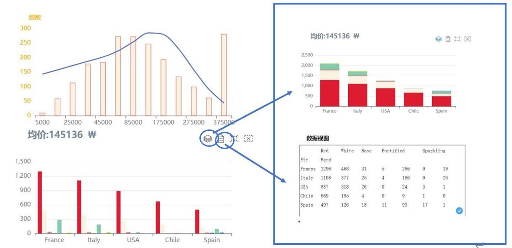

# 5.Analysis conclusion

**(1)** The total output of red wine and white wine in countries with a Mediterranean climate occupies an absolute proportion[[4\]](#_ftn4)

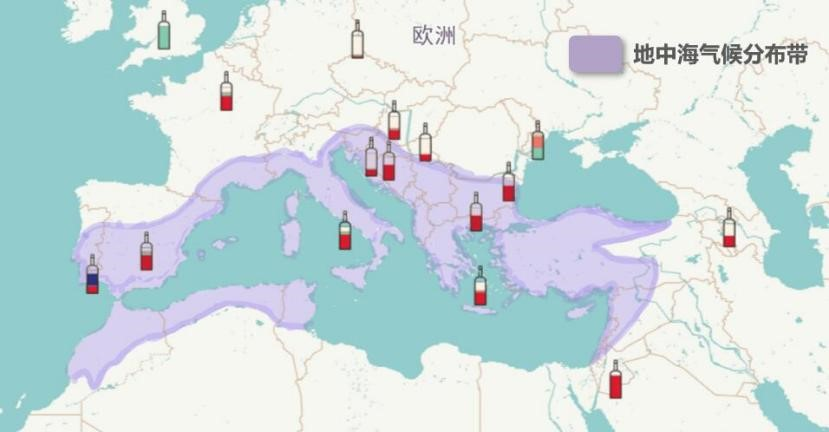

**(2)** The most relevant factor to wine price is drinking temperature (degree) (smoothed kernel density map of marginal histogram).

**(3)** Slightly sour wines generally have a higher price, and the determination of drinking temperature is highly related to the level of tannin and the level of wine body (it can be obtained from the parallel coordinates diagram and the Pearson coefficient matrix).

**(4)** Generally speaking, the longer the vintage, the higher the price of the wine. However, the impact of the year on the price of wine depends on the variety [[5\]](#_ftn5), the relationship between Fortified and the year is not obvious, and the Rose and the year are basically positively correlated (from the parallel coordinates graph). In this data set, some of the most expensive wines are not very old (can be obtained from the scatter plot below). 

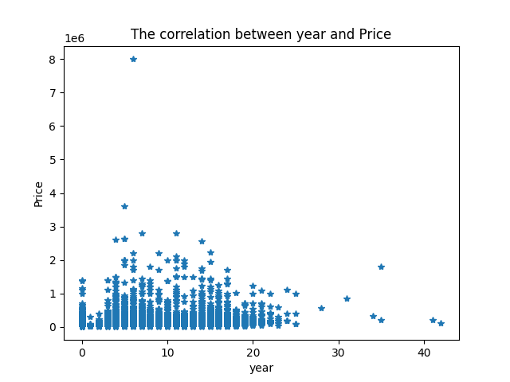

**(5)** There is no specific relationship between price and quality (hedonic index, which can be reflected from the four perspectives of wine body, acidity, sweetness, and tannin)[[6\]](#_ftn6).

**(6)** Alcohol content has basically nothing to do with price. (Because generally speaking, the higher the alcohol content, the more raw materials other than water are required, and the cost will be higher, so it is often considered that the higher the alcohol content, the higher the price).

**Note**

   **Visualization system folder**:

Open the **wine_vue3** folder with vs code, enable the terminal, and enter npm install. Then enter npm run dev to start (if there is any special situation, please contact us to solve it). Our visualization system can run normally locally (vue needs to configure the environment)

 

**Reference**

[1] Dimson E, Rousseau P L, Spaenjers C. The price of wine[J]. Journal of Financial Economics, 2015, 118(2): 431-449.

[2] Ashton R H. Wine as an experience good: Price versus enjoyment in blind tastings of expensive and inexpensive wines[J]. Journal of Wine Economics, 2014, 9(2): 171-182.

[3]Oczkowski E. A hedonic price function for Australian premium table wine[J]. Australian Journal of Agricultural Economics, 1994, 38(1): 93-110.

[4] Zhao W. Social categories, classification systems, and determinants of wine price in the California and French wine industries[J]. Sociological perspectives, 2008, 51(1): 163-199.

[5] Rössel J, Beckert J. Quality classifications in competition: Price formation in the German wine market[J]. Constructing quality: The classification of goods in markets, 2013, 288.

[6] Veale R, Quester P. Do consumer expectations match experience? Predicting the influence of price and country of origin on perceptions of product quality[J]. International business review, 2009, 18(2): 134-144.

------

[[1\]](#_ftnref1) If the operation in the python below is not specified, it will be processed.csv

[[2\]](#_ftnref2) Double-click the 7 pictures below to enlarge them (word format only)

[[3\]](#_ftnref3) France (France) is shown here as an example

[[4\]](#_ftnref4) means that the ratio is basically above 85%

[[5\]](#_ftnref5) Dimson E, Rousseau P L, Spaenjers C. The price of wine[J]. Journal of Financial Economics, 2015, 118(2): 431-449.

[[6\]](#_ftnref6) Ashton R H. Wine as an experience good: Price versus enjoyment in blind tastings of expensive and inexpensive wines[J]. Journal of Wine Economics, 2014, 9(2): 171-182.
